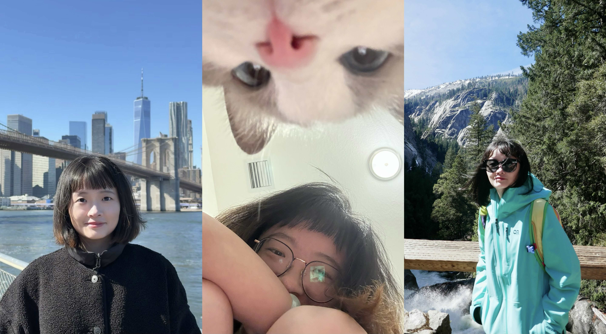

# Zhuomin Chen

Ph.D. Student in Computer Science, Florida International University

I work on explainable and trustworthy machine learning, with a focus on graph learning, time series modeling, and multimodal reasoning. My research aims to develop faithful explanation methods and evaluation frameworks that make modern AI systems more transparent, reliable, and accountable in high-stakes settings.

**Email:** zchen051@fiu.edu  
**GitHub:** [realMoana](https://github.com/realMoana)
**Google Scholar:** [Zhuomin Chen](https://scholar.google.com/citations?user=AICXb3IAAAAJ&hl=en&oi=ao)

---

## About

I am currently a Ph.D. student in Computer Science at Florida International University
<!-- , supervised by [Prof. Dongsheng Luo](https://scholar.google.com/citations?user=6Ih5XVkAAAAJ&hl=en) and [Prof. Mo Sha](https://scholar.google.com/citations?user=hVZiQDQAAAAJ&hl=en&oi=ao). I also collaborate closely with [Prof. Jingchao Ni](https://scholar.google.com/citations?user=rH9MTZMAAAAJ&hl=en).  -->
My research lies at the intersection of explainable AI, graph machine learning, and time-series intelligence. More broadly, I am interested in building machine learning systems whose decisions can be interpreted, verified, and trusted.

My recent work studies:
- faithful explanation methods for graph neural networks,
- robust evaluation frameworks for explainability,
- time-series explanation and reasoning,
- multimodal and human-centered machine learning.

---

## Selected Publications

**Addressing Distribution Shift in Explanations for Graph Neural Networks.** \
<u>Zhuomin Chen</u>, Hojat Allah Salehi, Esteban Schafir, Xu Zheng, Jiaxing Zhang, Hua Wei, Jingchao Ni, Farhad Shirani, Dongsheng Luo. \
Accepted by *IEEE Transactions on Pattern Analysis and Machine Intelligence (TPAMI)*.

**Explanation-Preserving Augmentation for Semi-Supervised Graph Representation Learning.**  
<u>Zhuomin Chen</u>, Jingchao Ni, Hojat Allah Salehi, Xu Zheng, Esteban Schafir, Farhad Shirani, Dongsheng Luo. \
*AAAI 2026.*

**F-Fidelity: A Robust Framework for Faithfulness Evaluation of Explainable AI.**  
Xu Zheng, Farhad Shirani, <u>Zhuomin Chen</u>, Chaohao Lin, Wei Cheng, Wenbo Guo, Dongsheng Luo. \
*ICLR 2025.*

**Generating In-Distribution Proxy Graphs for Explainable Graph Neural Networks.**  
<u>Zhuomin Chen</u>, Jiaxing Zhang, Jingchao Ni, Xiaoting Li, Yuchen Bian, Md Mezbahul Islam, Ananda Mohan Mondal, Hua Wei, Dongsheng Luo. \
*ICML 2024.*

**RegExplainer: Generating Explanations for Graph Neural Networks in Regression Task.**  
Jiaxing Zhang, <u>Zhuomin Chen</u>, Hao Mei, Dongsheng Luo, Hua Wei. \
*NeurIPS 2024.*

**TimeX++: Learning Time-Series Explanations with Information Bottleneck.**  
Zichuan Liu, Tianchun Wang, Jimeng Shi, Xu Zheng, <u>Zhuomin Chen</u>, Lei Song, Wenqian Dong, Jayantha Obeysekera, Farhad Shirani, Dongsheng Luo.  
*ICML 2024.*

[See full publication list on Google Scholar](https://scholar.google.com/citations?user=AICXb3IAAAAJ&hl=en&oi=ao)

---

## Preprints

- [2026] From Signals to Semantics: A Survey on Time Series Explainability through a Human-Cognitive Lens.  [[link](https://www.techrxiv.org/doi/abs/10.36227/techrxiv.176739863.31204174/v1)]

- [2026] GMAIS: Graph-based Memory for Agent Inference Scaling. 

- [2026] Trajectory Graph Copilot: Pre-Action Error Diagnosis in LLM Agents.  [[link](https://openreview.net/pdf?id=ighxnB6nJF)]

- [2025] Robust Surrogate Modeling for Explanation-Induced Out-of-Distribution Shift in GNNs.  [[link](https://arxiv.org/pdf/2508.01925)]

- [2025] Towards Structurally Explainable Machine-Generated Text Detection: A Graph-Perspective Framework.  [[link](https://arxiv.org/pdf/2505.12507)]

- [2025] Uncovering Insights of Compound Flooding with Data-Driven AI.  [[link]()]

---

## Professional Service

Reviewer for ICML, NeurIPS, ICLR, KDD, WWW, AAAI, ICDM, PAKDD, and journals including TPAMI, TKDE, TAI, TKDD, TMI, TBD, TNNLS, Expert Systems, and T-IFS.

Program Committee: ICML 2025, AAAI 2026, WWW 2026.

---

## Teaching

**Teaching Assistant**, Florida International University  
- Discrete Structures  
- Computer Data Analysis

---

## Awards

- NSF Travel Award for the Doctoral Forum at SDM 2024
- Provincial Outstanding Graduate
- First / Second Class Scholarships at Qingdao University and Taiyuan University of Technology

---

## Beyond Research
Outside of research, I enjoy going to concerts (I’m excited to see Bruno Mars and Ed Sheeran soon), watching TV shows (currently The Pitt), and traveling (especially hiking in U.S. national parks). I am always happy to connect with people interested in machine learning, explainability, and trustworthy AI.